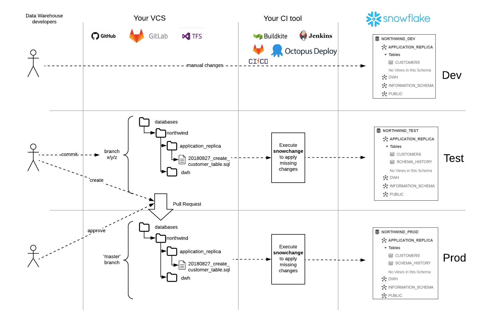

# snowchange


snowchange is a simple python script which helps manage schema changes for the [Snowflake](https://www.snowflake.com/) data warehouse.

When combined with a version control system and a CI/CD tool, schema changes can be approved and deployed through a pipeline using modern software delivery practises.

## Usage

It's just a single python file named [snowchange.py](snowchange.py). Create your own repository, copy it in there, and follow the example databases structure to get started.

### Project folder structure

snowchange expects a directory structure like the following to exist:
```
(rootfolder)
 |
 |-> database1
      |-> folder1
           |-> V1.1.1__first_change.sql
           |-> V1.1.2__second_change.sql
      |-> folder2
           |-> V1.1.3__third_change.sql
           |-> V1.1.4__fourth_change.sql
```

The folder structure is very flexible, the only requirement is that the first level of folders correspond to database names. Within a database folder there are no further requirements. snowchange will recursively find all change scripts and sort them by version. How you manage the scripts within each database folder is up to you.

If you add the `-n` flag (or `--append-environment-name`) then the environment name (specified in the `-e` or `--environment-name` argument) will be appended to the database name with an underscore. This can be used to support multiple environments (dev, test, prod) within the same Snowflake account.

Every database will have a table automatically created to track the history of changes applied. The table `CHANGE_HISTORY` will be created within a `SNOWCHANGE` schema. You will need a user account that has the ```CREATE DATABASE``` account-level permission. 

### Script naming
Change scripts follow a similar naming convention to that used by [Flyway Versioned Migrations](https://flywaydb.org/documentation/migrations#versioned-migrations). An example of a script name might be `V1.1.1__first_change.sql`. The overall structure of the script name must follow these rules:

* Begin with the letter "V"
* Followed by a unique version (e.g. 1.0.0)
* Followed by two underscores (__)
* Followed by an artibrary name (which can not include two underscores)

As with Flyway, the unique version string is very flexible. You just need to be consistent and always use the same convention, like 3 sets of numbers separated by periods. Here are a few valid version strings:

* 1
* 5.2
* 1.2.3.4.5.6.7.8.9
* 205.68
* 20130115113556
* 2013.1.15.11.35.56

### Running the script

If your build agent has python 3 installed, the script can be ran like so:
```
pip install --upgrade snowflake-connector-python
python snowchange.py -f <Root Folder Path> -e <Environment> -a <Snowflake Account> --snowflake-region <Snowflake Region> -u <Snowflake User> -r <Snowflake Role> -w <Snowflake Warehouse>
```
It is expected that the environment variable `SNOWSQL_PWD` be set prior to calling the script, you should make this available to your build agent in some secure fashion.

Or if you prefer docker, set the environment variables and run like so:
```
docker run -it --rm \
  -v "$PWD":/usr/src/snowchange \
  -w /usr/src/snowchange \
  -e SNOWFLAKE_ACCOUNT \
  -e SNOWFLAKE_USER \
  -e SNOWFLAKE_ROLE \
  -e SNOWFLAKE_WAREHOUSE \
  -e SNOWFLAKE_REGION \
  -e SNOWSQL_PWD \
  --name snowchange-script \
  python:3 /bin/bash -c "pip install --upgrade snowflake-connector-python && python snowchange.py -e $ENVIRONMENT_NAME -a $SNOWFLAKE_ACCOUNT -u $SNOWFLAKE_USER -r $SNOWFLAKE_ROLE -w $SNOWFLAKE_WAREHOUSE --snowflake-region $SNOWFLAKE_REGION"
```

## The script in context

Here's an example configuration, where pull requests move changes between environments.



## Notes

This is a community-developed script, not an official Snowflake offering. It comes with no support or warranty. However, feel free to raise a github issue if you find a bug or would like a new feature.

## Maintainers

- James Weakley (@jamesweakley)
- Jeremiah Hansen (@jeremiahhansen)

## License

This project is licensed under the MIT License - see the [LICENSE](LICENSE) file for details
